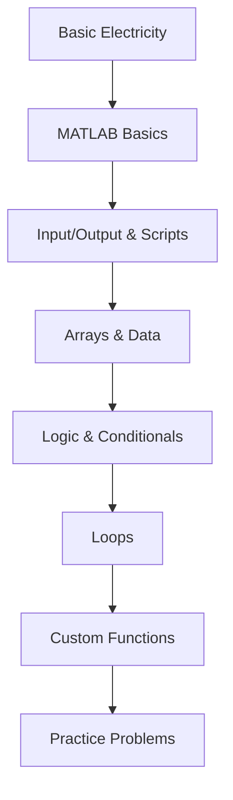

---
## 🎓 Learning Path Overview

---

## 📚 Complete Course Content (68 Concepts)

### ⚡ 1. Basic Electricity (6 concepts)
**Foundation**: Start here for electrical engineering fundamentals

- [[3 - Knowledge/Concepts/1 - Basic Electricity/1.6 Resistors|1.6 Resistors]] 
- [[3 - Knowledge/Concepts/1 - Basic Electricity/1.7 Ohm's Law|1.7 Ohm's Law]] 
- [[3 - Knowledge/Concepts/1 - Basic Electricity/1.17 Series and parallel combinations|1.17 Series and parallel combinations]]
- [[3 - Knowledge/Concepts/1 - Basic Electricity/1.18 Voltage divider|1.18 Voltage divider]]
- [[3 - Knowledge/Concepts/1 - Basic Electricity/1.26 Binary numbers|1.26 Binary numbers]]
- [[3 - Knowledge/Concepts/1 - Basic Electricity/1.27 Capacitors|1.27 Capacitors]]

### 💻 3. MATLAB Fundamentals (8 concepts)
**Core Skills**: Essential MATLAB programming foundation

- [[3 - Knowledge/Concepts/3 - MATLAB/3.1 Solving engineering problems with  MATLAB|3.1 Solving engineering problems with MATLAB]]
- [[3 - Knowledge/Concepts/3 - MATLAB/3.3 MATLAB and the interpreter|3.3 MATLAB and the interpreter]]
- [[3 - Knowledge/Concepts/3 - MATLAB/3.4 Variables and assignments|3.4 Variables and assignments]]
- [[3 - Knowledge/Concepts/3 - MATLAB/3.6 Numeric variables|3.6 Numeric variables]]
- [[3 - Knowledge/Concepts/3 - MATLAB/3.7 Numeric expressions|3.7 Numeric expressions]]
- [[3 - Knowledge/Concepts/3 - MATLAB/3.8 Mathematical constants|3.8 Mathematical constants]]
- [[3 - Knowledge/Concepts/3 - MATLAB/3.10 String scalars|3.10 String scalars]]
- [[3 - Knowledge/Concepts/3 - MATLAB/3.13 Lab-O - intro to Matlab 1|3.13 Lab-O - intro to Matlab 1]]

### 📝 4. Input, Output & Advanced Scripting (10 concepts)
**Practical Skills**: Scripts, functions, plotting, and formatting

- [[3 - Knowledge/Concepts/4 - Input, fprintf, Comments, Script, build-in functions, and Plotting/4.1 Scripts|4.1 Scripts]]
- [[3 - Knowledge/Concepts/4 - Input, fprintf, Comments, Script, build-in functions, and Plotting/4.2 Comments and clear code|4.2 Comments and clear code]]
- [[3 - Knowledge/Concepts/4 - Input, fprintf, Comments, Script, build-in functions, and Plotting/4.3 Internal mathematical functions|4.3 Internal mathematical functions]]
- [[3 - Knowledge/Concepts/4 - Input, fprintf, Comments, Script, build-in functions, and Plotting/4.6 Basic output II - fprintf|4.6 Basic output II - fprintf]]
- [[3 - Knowledge/Concepts/4 - Input, fprintf, Comments, Script, build-in functions, and Plotting/4.7 Floating-point formatting in fprintf|4.7 Floating-point formatting in fprintf]]
- [[3 - Knowledge/Concepts/4 - Input, fprintf, Comments, Script, build-in functions, and Plotting/4.8 Simple plotting|4.8 Simple plotting]]
- [[3 - Knowledge/Concepts/4 - Input, fprintf, Comments, Script, build-in functions, and Plotting/4.9 2D Data plots I|4.9 2D Data plots I]]
- [[3 - Knowledge/Concepts/4 - Input, fprintf, Comments, Script, build-in functions, and Plotting/4.10 2D Data plots II|4.10 2D Data plots II]]
- [[3 - Knowledge/Concepts/4 - Input, fprintf, Comments, Script, build-in functions, and Plotting/4.13 Calculate the area of a circle 1|4.13 Calculate the area of a circle 1]]
- [[3 - Knowledge/Concepts/4 - Input, fprintf, Comments, Script, build-in functions, and Plotting/4.14 Calculate the volume of a cone|4.14 Calculate the volume of a cone]]

### 📊 5. Arrays & Data Structures (16 concepts)
**Data Management**: Essential for engineering calculations

#### 5.1-5.9: Basic Arrays
- [[3 - Knowledge/Concepts/5 - Arrays/5.1 Introduction to arrays|5.1 Introduction to arrays]]
- [[3 - Knowledge/Concepts/5 - Arrays/5.2 Row arrays|5.2 Row arrays]]
- [[3 - Knowledge/Concepts/5 - Arrays/5.3 Constructing row arrays|5.3 Constructing row arrays]]
- [[3 - Knowledge/Concepts/5 - Arrays/5.4 Column arrays|5.4 Column arrays]]
- [[3 - Knowledge/Concepts/5 - Arrays/5.5 Multi-Element row array  indexing using integer arrays|5.5 Multi-Element row array indexing using integer arrays]]
- [[3 - Knowledge/Concepts/5 - Arrays/5.6 Multi-element row array indexing using logical arrays|5.6 Multi-element row array indexing using logical arrays]]
- [[3 - Knowledge/Concepts/5 - Arrays/5.7 Row array resizing|5.7 Row array resizing]]
- [[3 - Knowledge/Concepts/5 - Arrays/5.8 Functions to create numeric row arrays|5.8 Functions to create numeric row arrays]]
- [[3 - Knowledge/Concepts/5 - Arrays/5.9 1D Element-wise arithmetic operators|5.9 1D Element-wise arithmetic operators]]

#### 5.10-5.16: Advanced Arrays & 2D Operations
- [[3 - Knowledge/Concepts/5 - Arrays/5.10 2D arrays|5.10 2D arrays]]
- [[3 - Knowledge/Concepts/5 - Arrays/5.11 Indexing an element in a 2D array|5.11 Indexing an element in a 2D array]]
- [[3 - Knowledge/Concepts/5 - Arrays/5.12 Concatenation|5.12 Concatenation]]
- [[3 - Knowledge/Concepts/5 - Arrays/5.14 Indexing rows and columns using a single colon|5.14 Indexing rows and columns using a single colon]]
- [[3 - Knowledge/Concepts/5 - Arrays/5.15 Manipulating 2D arrays using a single colon|5.15 Manipulating 2D arrays using a single colon]]
- [[3 - Knowledge/Concepts/5 - Arrays/5.16 2D element-wise arithmetic operators|5.16 2D element-wise arithmetic operators]]

### 🧠 6. Logic & Conditional Statements (9 concepts)
**Decision Making**: Programming logic and control flow

- [[3 - Knowledge/Concepts/6 - Relational Operators, Logical Operators and Conditional Statements/6.1 Logical variables|6.1 Logical variables]]
- [[3 - Knowledge/Concepts/6 - Relational Operators, Logical Operators and Conditional Statements/6.2 Logical and relational operators|6.2 Logical and relational operators]]
- [[3 - Knowledge/Concepts/6 - Relational Operators, Logical Operators and Conditional Statements/6.3 Logical expressions|6.3 Logical expressions]]
- [[3 - Knowledge/Concepts/6 - Relational Operators, Logical Operators and Conditional Statements/6.5 Logic precedence rules|6.5 Logic precedence rules]]
- [[3 - Knowledge/Concepts/6 - Relational Operators, Logical Operators and Conditional Statements/6.6 If-else statement|6.6 If-else statement]]
- [[3 - Knowledge/Concepts/6 - Relational Operators, Logical Operators and Conditional Statements/6.7 Relational operators|6.7 Relational operators]]
- [[3 - Knowledge/Concepts/6 - Relational Operators, Logical Operators and Conditional Statements/6.8 Multiple branches|6.8 Multiple branches]]
- [[3 - Knowledge/Concepts/6 - Relational Operators, Logical Operators and Conditional Statements/6.9 Logical operators|6.9 Logical operators]]
- [[3 - Knowledge/Concepts/6 - Relational Operators, Logical Operators and Conditional Statements/6.10 The switch statement|6.10 The switch statement]]

### 🔄 7. Loops & Iteration (6 concepts)
**Repetition**: Automating repetitive tasks

- [[3 - Knowledge/Concepts/7 - Loops/7.1 For loops|7.1 For loops]]
- [[3 - Knowledge/Concepts/7 - Loops/7.2 While loops|7.2 While loops]]
- [[3 - Knowledge/Concepts/7 - Loops/7.3 More while examples|7.3 More while examples]]
- [[3 - Knowledge/Concepts/7 - Loops/7.4 Counting|7.4 Counting]]
- [[3 - Knowledge/Concepts/7 - Loops/7.5 Nested loops|7.5 Nested loops]]
- [[3 - Knowledge/Concepts/7 - Loops/7.6 Loops and arrays|7.6 Loops and arrays]]

### ⚙️ 8. Custom Functions (7 concepts)
**Modularity**: Writing reusable, organized code

- [[3 - Knowledge/Concepts/8 - Custom Functions/8.1 Custom functions - Basics|8.1 Custom functions - Basics]]
- [[3 - Knowledge/Concepts/8 - Custom Functions/8.2 Scripts with local functions|8.2 Scripts with local functions]]
- [[3 - Knowledge/Concepts/8 - Custom Functions/8.3 Functions with local functions|8.3 Functions with local functions]]
- [[3 - Knowledge/Concepts/8 - Custom Functions/8.4 Nested functions|8.4 Nested functions]]
- [[3 - Knowledge/Concepts/8 - Custom Functions/8.5 Anonymous functions|8.5 Anonymous functions]]
- [[3 - Knowledge/Concepts/8 - Custom Functions/8.9 Persistent variables|8.9 Persistent variables]]
- [[3 - Knowledge/Concepts/8 - Custom Functions/8.10 Recursion|8.10 Recursion]]
- [[3 - Knowledge/Concepts/8 - Custom Functions/8.11 Counting function arguments|8.11 Counting function arguments]]

### 🎯 9. MATLAB Practice Problems (6 concepts)
**Application**: Real-world problem solving

- [[3 - Knowledge/Concepts/9 - MATLAB Review Questions/9.1 Convert Temperature Function|9.1 Convert Temperature Function]]
- [[3 - Knowledge/Concepts/9 - MATLAB Review Questions/9.2 Calculate the area of a circle|9.2 Calculate the area of a circle]]
- [[3 - Knowledge/Concepts/9 - MATLAB Review Questions/9.3 Elementwise multiplication of vectors|9.3 Elementwise multiplication of vectors]]
- [[3 - Knowledge/Concepts/9 - MATLAB Review Questions/9.4 Calculating current using Kirchhoff loops|9.4 Calculating current using Kirchhoff loops]]
- [[3 - Knowledge/Concepts/9 - MATLAB Review Questions/9.5 Write a function to calculate the normalized sinc|9.5 Write a function to calculate the normalized sinc]]
- [[3 - Knowledge/Concepts/9 - MATLAB Review Questions/9.6 Determine the drag coefficient by fitting a polynomial to velocity-force data|9.6 Determine the drag coefficient by fitting a polynomial to velocity-force data]]

---

## 🗂️ Course Materials & Resources

### 📚 Course Structure
- [[1 - Courses/ENG 1181 - Fund of Engineering I|Course Home]]
- [[1 - Courses/ENG 1181 - Fund of Engineering I/Lectures|Lectures]]
- [[1 - Courses/ENG 1181 - Fund of Engineering I/Assignments|Assignments]]
- [[1 - Courses/ENG 1181 - Fund of Engineering I/Lab|Lab Work]]
- [[1 - Courses/ENG 1181 - Fund of Engineering I/Resources|Resources]]

### 📖 Reference Materials
- [[1 - Courses/ENG 1181 - Fund of Engineering I/Resources/Fundamentals-of-Engineering-Technical-Communications.pdf|Technical Communications PDF]]

---

## 📈 Study Strategy & Progress Tracking

### 🎯 Weekly Study Plan
**Week 1-2**: Foundation (Electricity + MATLAB Basics)
**Week 3-4**: Data Handling (Arrays + I/O)
**Week 5-6**: Logic & Control (Conditionals + Loops)
**Week 7-8**: Advanced Programming (Functions + Practice)

### 📊 Progress Checklist
#### Foundation ⚡💻 (14/68 concepts)
- [ ] Complete all Basic Electricity concepts
- [ ] Master MATLAB fundamentals
- [ ] Understand variable types and expressions

#### Intermediate 📝📊 (26/68 concepts)
- [ ] Scripts, plotting, and formatting
- [ ] Array creation and manipulation
- [ ] 2D array operations

#### Advanced 🧠🔄 (15/68 concepts)
- [ ] Logical operations and conditionals
- [ ] Loop structures and iteration
- [ ] Control flow mastery

#### Expert ⚙️🎯 (13/68 concepts)
- [ ] Function design and implementation
- [ ] Problem-solving with real applications
- [ ] Integration of all concepts

### 🔗 Quick Navigation
- **Templates**: [[0-Meta/Templates]] - Study session, lecture, assignment templates
- **Media**: [[4 - Media]] - Diagrams, screenshots, and visual aids
- **Practice**: Focus on sections 4, 8, and 9 for hands-on coding

---

## 🏆 A+ Success Metrics

### Mastery Indicators
- [ ] **Conceptual Understanding**: Can explain without notes
- [ ] **Practical Application**: Can code solutions independently
- [ ] **Problem Integration**: Can combine multiple concepts
- [ ] **Speed & Accuracy**: Can solve problems within time limits

### Study Techniques
1. **Active Recall**: Test yourself without looking at notes
2. **Spaced Repetition**: Review concepts at increasing intervals
3. **Practice Coding**: Write code daily, even for 15 minutes
4. **Teach Back**: Explain concepts to others (or to yourself)